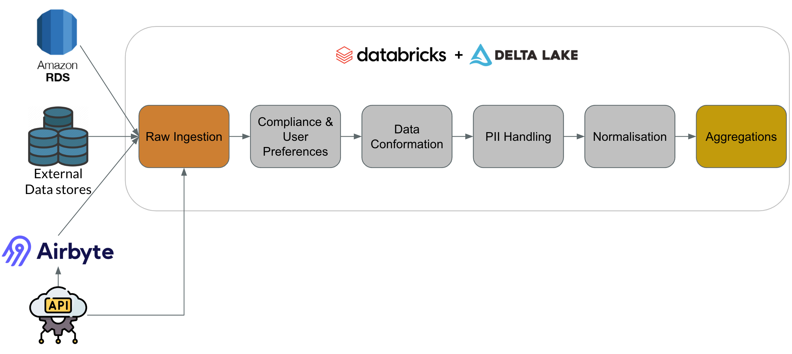

The image and table below provide a high-level description of the ingestion and transformation process I think is the most suitable for the questions provided.

|                          |                              Raw Ingestion                               |                           Compliance                           |                                             Conformation                                              |                                     PII                                     |                                    Normalisation                                    |                                                  Aggregations                                                   |
|--------------------------|:------------------------------------------------------------------------:|:--------------------------------------------------------------:|:-----------------------------------------------------------------------------------------------------:|:---------------------------------------------------------------------------:|:-----------------------------------------------------------------------------------:|:---------------------------------------------------------------------------------------------------------------:|
| Business Transformations |                                    ❌                                     |                               ❌                                |                                                   ✅                                                   |                                      ✅                                      |                                          ✅                                          |                                                        ✅                                                        |
| Masked/Hidden PII        |                                    ❌                                     |                               ❌                                |                                                   ❌                                                   |                                      ✅                                      |                                          ✅                                          |                                                        ✅                                                        |
| Access Level             |                             Developers only                              |                           Privileged                           |                                              Privileged                                               |                                     All                                     |                                         All                                         |                                                       All                                                       |
| Data Quality Level       |                                   Low                                    |                              Low                               |                                                 High                                                  |                                    High                                     |                                        High                                         |                                                     Highest                                                     |
| Output Table(s) Design   |                                   OBT                                    |                              OBT                               |                                                  OBT                                                  |                                     OBT                                     |                                      3NF/Star                                       |                                                   Standalone                                                    |
| Purpose                  | Tabulate ingested data and provide a reference point for recent recovery | Remove data that shouldn’t be processed for analytics purposes | Build a uniform, logical, consistent, and reliable source of truth that is easy to understand and use | Remove or mask PII and sensitive data to allow company-wide use of the data | Provide an analytics-ready data model for dashboard building and efficient querying | Provide a source of truth for business KPIs and decrease the barrier-of-entry to using data in the organisation |
